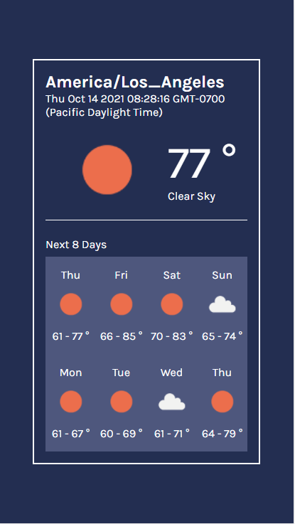

# Weather App - OpenWeather API

This project was bootstrapped with [Create React App](https://github.com/facebook/create-react-app).

## Available Scripts

### `npm start`

Runs the app in the development mode.\
Open [http://localhost:3000](http://localhost:3000) to view it in the browser.

The page will reload if you make edits.\
You will also see any lint errors in the console.

- In order to properly run, please generate your own API key for OpenWeather API

## Screenshot

## Links
- [Solution URL](https://github.com/jma26/WeatherApp-OpenWeather-API)
- [Live URL](https://jma26.github.io/WeatherApp-OpenWeather-API/)

## Technologies
- React.js (v17.0.2)
- Node.js (v14.16.0)
- [OpenWeather API](https://openweathermap.org/)

## Continued Development
- Toggle feature between imperial and metric system
- Background color changes depending on weather description + icon
~~- Error handling + component~~